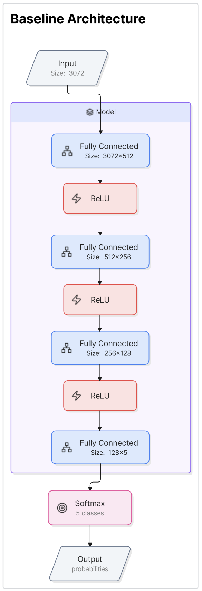
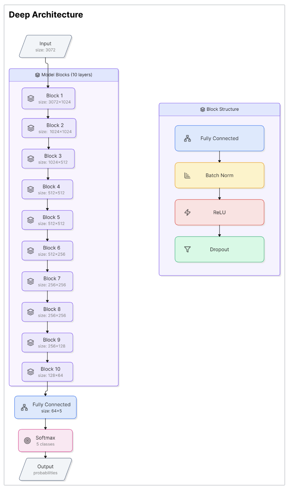
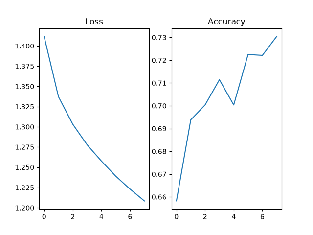
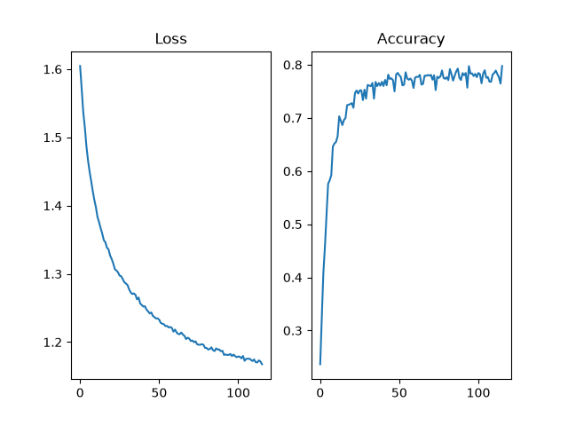
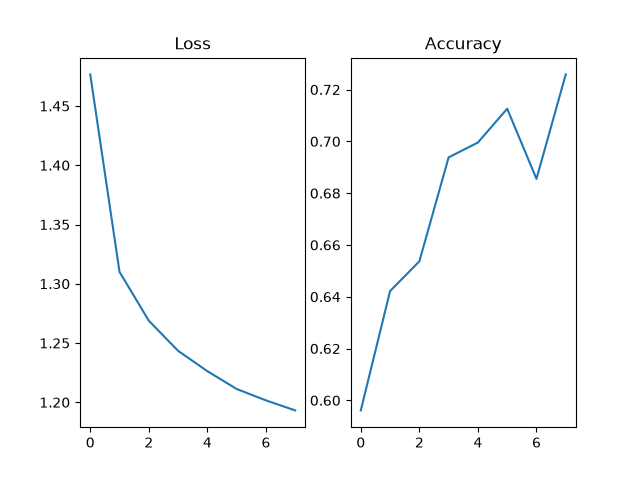
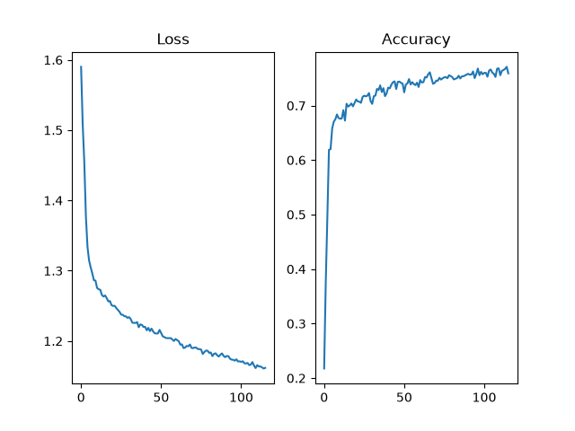

# From Scratch Neural Network Framework

A lightweight neural network framework built from scratch using NumPy, including modular layers, forward and backward propagation, training utilities and evaluation tools.

## Features:
- NumPy-only ML framework implementation
- Modular layer system
- Forward and backward propagation
- Batch normalisation and dropout
- Training and inference modes
- CIFAR-10 experiments
- PyTorch reference comparison

The framework implements the core components of feed-forward neural networks using NumPy and does not rely on existing deep learning libraries. The goal of this project was to understand deep learning at a lower level by implementing the core components from scratch. This provides intuition into what happens under the hood and helps develop better understanding of model design and optimisation.


The project is split into two sections:

- **Framework**: Core neural network components and utilities.
- **Application**: Experiment code that uses the framework to train and evaluate models.

---
# Framework

The framework contains the modular, reusable components required to build and train neural networks.


## Includes

- Fully connected layers
- Batch Normalisation
- Dropout
- Activation functions and derivatives
- Loss functions
- Forward and backward propagation
- Data processing utilities
- Evaluation metrics


All framework code is inside
```text
Project
└── src/
    └── framework/
```

## Limitation
This project was intended to be an educational framework rather than a production ready library. Current limitation are:
- CPU only execution
- No computational graph
- No omtimiser abstraction - currently only supports SGD without momentum
- Limited layer types


---
# Using the Framework

## Creating Models
 - Extend `framework.nn.Model.Model` and call `super().__init__(lossname)`
 - Inside the `__init__` define a list `self.model` containing layers from `framework.nn.Layers`

Example:
```python
from framework.nn.Model import Model
import framework.nn.Layers as Layers

class myMlp(Model):
    def __init__ (self, loss):
        super().__init__(loss)
        self.model = [Layers.FullyConnected(512, 256, initMethod = "uniform"),
                      Layers.ActivationLayer("RELU"),
                      Layers.FullyConnected(256, 128, initMethod = "uniform"),
                      Layers.ActivationLayer("RELU"),
                      Layers.FullyConnected(128, 5, "GLOROT"),
                      Layers.ActivationLayer("softmaxWithCrossEntropy")]
```

## Using a Model
- When creating an instance of a model a name of a loss function is passed - `myModel = myMlp("CrossEntropyLossWithSoftMax")`
- Call `Model.trainMode()` to get training behaviour and `Model.inferenceMode()` to get evaluating behaviour
- Call `prediction = Model.forward(inputs)` to perform forward pass and return prediction
- Call `loss = Model.loss(trueLabel, prediction)` to find loss -- does not  affect gradients
- Call `Model.backward(trueLabel, prediction, learningRate)` to perform back propagation and updates parameters

Example:
```python
MLP = myMlp("CrossEntropyLossWithSoftMax")

for epoch in range(totalEpochs):
    MLP.trainMode()
    for x, y in trainingSet:
        y_ = MLP.forward(x)
        loss = MLP.loss(y, y_)
        MLP.backward(y, y_, lr)
    
    MLP.inferenceMode()
    for x, y in validationSet:
        y_ = MLP.forward(x)
        loss = MLP.loss(y, y_)
```


---
# Application

The application contains the code used to run experiments with the framework.

## Includes

- Dataset loading and preparation
- Model architectures
- Training loop
- Validation and testing
- Experiment configuration
- Saving results and checkpoints


The application currently contains two model architectures to evaluate different network depths to see if gradients still flow in larger models.

The included model architectures were:
- A baseline model with 4 layers
- A deep model over 10 layers

### Architecture:
 

---
# PyTorch Reference
A basic PyTorch copy of the model files are included.
This was included to compare the framework to a mature library.

Files can be found here:
```text
Project
└── src/
    └── pytorchReference/
```
Inside is a main.py which runs the experiments with the same model and parameters but written in PyTorch.

To run the baseline model call:
```bash
python main.py baseline
```

To run the deep model call:
```bash
python main.py deep
```


---
# Dataset
The current experiments use the CIFAR-10 dataset stored in the dataset folder in project root.


The data loader expects CIFAR-10 batch files and metadata file inside that folder such that:
```text
Project
└── dataset/
    └── cifar-10/
        ├── batches.meta
        ├── ...
        .
        .
```

To use different datasets change the config files `datasetFolder` and write a custom data loader function that returns flattened NumPy arrays

---
# Installation

```bash
pip install -r requirements.txt
```

---
# Running
To run application navigate to `Project/src/application`

Experiments are controlled through a main file and a YAML configuration file

There are four pre-made demo experiments which include:
- Baseline model test from pretrained model weights file:
```bash
python main.py baseline test
```

- Deep model test from pretrained model weights file:
```bash
python main.py deep test
```
- Baseline model training from fresh weights:
```bash
python main.py baseline train
```

- Deep model training from fresh weights:
```bash
python main.py deep train
```

A custom config file can also be used:
```bash
python main.py custom {config}.yaml
```

---
# Results
Experiments were run on a subset of the CIFAR-10 dataset.

Five arbitrary classes were selected which are:
- bird
- deer
- dog
- frog
- horse

## Baseline Model
Achieved an accuracy of 73.28%

Training required 8 epochs and took about 11 seconds



## Deep Model
Achieved an accuracy of 79.74%

Training required 116 epochs and took 13 minutes 28 seconds



## PyTorch models
### Baseline Model
Achieved an accuracy of 71.78%

Trained for 8 epochs and took about 4 seconds



### Deep Model
Achieved an accuracy of 76.24%

Trained for 116 epochs and took about 1 minute 50 seconds




## Discussion
As the results show the framework does perform well for the same models with very similar config as PyTorch. The large differences in time are primarily caused due to CPU vs GPU runtime, as the PyTorch version was run on the gpu. I choose gpu as it's more realistic to how PyTorch would be used despite being a different environment to the NumPy model.

In the same amount of epochs the framework version's accuracy surpassed the PyTorch version in both baseline and deep models. I think this can likely be put down to hyperparameters that were tuned for the NumPy framework as well as some numerical differences in modules like batch normalisation. I want to make it clear this doesn't mean the NumPy framework is superior to PyTorch and if given more time and the correct hyperparameters the PyTorch version will likely surpass the framework.

This being said the goal was to test the framework on both a simple smaller task and a larger task to ensure correct gradient handling through deep layers. There is strong evidence that the framework can hold up well against both.


---
# Project Structure
```
Project
├── dataset/
    └── cifar-10/
├── experiments/
└── src/
    ├── framework/
        ├── functions/
            ├── activation.py
            ├── derivatives.py
            └── lossFuncs.py
        ├── nn/
            ├── Layers.py
            ├── Model.py
        └── utility/
            ├── data.py
            ├── evaluation.py
            └── preprocess.py
    ├── application/
        ├── models/
            ├── baseLineModel.py
            └── deepModel.py
        ├── configs/
        ├── loadData.py
        ├── utility.py
        ├── trainer.py
        └── main.py
    └── pytorchReference/
        ├── baseline.py
        ├── deep.py
        └── main.py
    
```
